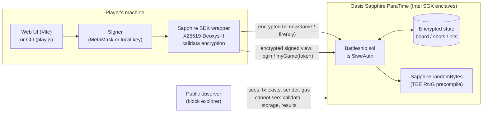

# Confidential Battleship on Oasis Sapphire

**Course project write-up — Privacy on Blockchain**

Contract (Sapphire Testnet): [`0x1172C51280765764DdEEc83d5fd10a10D395BC17`](https://explorer.oasis.io/testnet/sapphire/address/0x1172C51280765764DdEEc83d5fd10a10D395BC17)

---

## 1. Abstract

This project implements a battleship game against the house in which the
opponent's board is *secret on-chain state*. The contract places a fleet using
hardware-backed randomness, stores it in encrypted contract storage on Oasis
Sapphire — a confidential EVM ParaTime executing inside Intel SGX enclaves —
and answers each shot without revealing anything to outside observers: not the
board, not the cell fired at, not even whether the shot hit. The player reads
their own progress through an authenticated, encrypted view channel based on
Sign-In-With-Ethereum (SIWE) tokens.

The game is intentionally small, but it still needs the main pieces a private
application needs: secret state, fair randomness, selective disclosure, and
integrity of responses.

## 2. The problem

On a public EVM chain this game cannot be built naively. Contract storage is
world-readable: anyone can call `eth_getStorageAt` and read the board before
firing a single shot. The textbook workaround is a commit-and-prove design —
the server commits to a board hash, and every hit/miss answer ships with a
zero-knowledge proof that it is consistent with the commitment. That works,
but it requires a circuit, a proving pipeline, and per-move proving cost.

The same tension applies to every realistic financial workflow: salaries,
auction bids, order books, credentials. Public-by-default breaks them all.
This project explores the TEE answer to that problem.

## 3. Choice of privacy primitive

The four standard options, evaluated against this application's data flow:

| Primitive | Fit | Why / why not |
|---|---|---|
| **ZK** | Poor fit | The *contract* (house) holds the secret, not the user. ZK lets a data owner prove statements about data they hold; here the player holds nothing. A ZK design inverts into commit-and-prove with a trusted prover server off-chain — the server still sees everything, so it is effectively a trusted party anyway, plus circuit complexity and per-move proving latency. |
| **FHE** | Workable, expensive | An fhEVM contract could store an encrypted board and compare shots homomorphically. But every hit/miss answer needs threshold decryption (an async oracle round-trip per shot), and FHE comparisons are orders of magnitude more expensive than plain ops. Turn latency would dominate the game. |
| **MPC** | Wrong trust shape | MPC needs ≥2 non-colluding input parties to make sense. This is a 1-player-vs-contract game; there is no natural second data owner. Using MPC nodes purely as a decentralized TEE substitute adds communication cost without changing the trust story the player cares about. |
| **TEE** | **Chosen** | The state lives *in* the execution environment, which is exactly what a confidential runtime provides. Plain Solidity, near-native speed, synchronous answers (one transaction per shot), and hardware randomness as a free primitive. The cost is a hardware trust assumption, analyzed in §5. |

Using the lecture heuristic, this is closest to the TEE case: the computation
is server-side, single-party, and latency-sensitive.

**Platform.** Oasis Sapphire was chosen over building on raw SGX (Gramine)
because it provides the full confidential-EVM stack as infrastructure:
encrypted storage and calldata, key management across the validator set,
remote attestation enforced at consensus layer, and standard EVM tooling
(Hardhat, ethers). A from-scratch SGX build would spend the entire project
budget on attestation plumbing rather than on the application's privacy
semantics.

## 4. Architecture



### 4.1 Data flow of one move

```
Player                    Sapphire enclave                  Public chain data
  |                             |                                  |
  |--- fire(x,y) -------------->|   calldata encrypted client-side |
  |    (Deoxys-II envelope)     |   tx visible, target cell not -->| sender, gas, time
  |                             |   board ^= check bit (x,y)       |
  |                             |   update shots/hits in           |
  |                             |   encrypted storage              |
  |                             |   emit NOTHING                   |  (no logs)
  |                             |                                  |
  |--- myGame(token) ---------->|   SIWE token decrypted,          |
  |    encrypted eth_call       |   player address recovered       |
  |<-- shots, hits, status -----|   response encrypted to caller   |  (nothing)
```

### 4.2 Components

- **`contracts/Battleship.sol`** — the entire game: an 8×8 grid as a `uint64`
  bitmap, ships of length 3+2+2 (7 cells), 24-shot limit. Inherits `SiweAuth`
  from `@oasisprotocol/sapphire-contracts`.
- **`contracts/test/TestBattleship.sol`** — test-only subclass that overrides
  the randomness seed and starts deterministic games with a known valid board,
  so the logic is unit tested on a vanilla Hardhat network (13 tests).
- **`scripts/play.js`** — CLI client; renders the board as ASCII.
- **`frontend/`** — web client (Vite + ethers + Sapphire wrapper): clickable
  grid, SIWE login, per-shot transactions, explorer links for verification.

### 4.3 Key design decisions

**Randomness.** The fleet is placed from a 32-byte seed drawn from
`Sapphire.randomBytes`, the ParaTime's TEE randomness precompile. The seed
stays in confidential state; the placement stream is derived by hashing the
seed with a counter. No oracle or block-hash randomness is used, and the board
is not known to the player or operator.

**No events.** Event logs are **public** on Sapphire even though storage and
calldata are encrypted. Emitting `Hit(x, y)` would leak the game to the
explorer, so `fire()` returns nothing and emits nothing. Results are only
available through the authenticated view. A unit test pins this
(`receipt.logs.length === 0`).

**Authenticated views via SIWE.** On Sapphire, `eth_call` queries are
*unauthenticated*: `msg.sender` is always `address(0)` (the SDK removed
client-signed queries in v2). The contract inherits `SiweAuth`: the player
signs a standard Sign-In-With-Ethereum message; `login()` verifies the
signature on-chain (inside the enclave), and returns an *encrypted* auth token
(valid 24 h) binding the player's address. `myGame(token)` and
`revealBoard(token)` recover the caller from the token and refuse to serve
anyone else's game. In transaction context, plain `msg.sender` is used — there
it is authenticated by the transaction signature itself.

**Reveal only after game over.** `revealBoard` reverts while a game is
active, so even the authenticated player cannot peek mid-game.

## 5. Threat model

### 5.1 Assets

1. **Board layout** (ship positions) — the core secret, until game end.
2. **Game progress** (which cells fired, hit/miss outcomes) — secret to
   everyone but the player.
3. **Fairness** — the board must be fixed at `newGame` time and the RNG
   unbiased; the house must not adapt to the player's shots.

### 5.2 Adversaries and what they see

| Adversary | Capabilities | What they learn | What they cannot learn |
|---|---|---|---|
| **Chain observer** (explorer, indexer) | Reads all public chain data | Player address, tx count and timing, gas used per tx, contract address | Target cells (calldata encrypted), board, hit/miss results, game state (storage encrypted, no events) |
| **RPC / gateway operator** | Sees encrypted envelopes, can censor or delay | Same as observer, plus the player's IP | Same — plaintext exists only inside enclaves |
| **Sequencer / validator without enclave compromise** | Orders and executes txs *inside* SGX | Nothing beyond a chain observer | State plaintext (keys live in enclaves) |
| **The player** | Sends arbitrary txs and queries | Own results via SIWE token | The board before game end (`revealBoard` gated); other players' games (per-address auth) |
| **Other Sapphire users** | Same as player | Nothing about this player's games (`NoFinishedGame` / `NotAuthenticated`) | — |
| **Enclave-compromising adversary** (broken SGX, side-channel extraction, malicious Intel) | Reads enclave memory / keys | Everything: boards, RNG seeds, all confidential state | — (out of scope; see §5.4) |

### 5.3 Known leaks (deliberate scope acceptances)

**Gas side channel — measured, not hypothetical.** The hit branch of `fire()`
performs extra storage writes. Measured on the live testnet deployment:

| Transaction | Gas used |
|---|---|
| `fire` — miss (three samples) | 29,783 / 29,783 / 29,783 |
| `fire` — hit | 30,664 |

The 881-gas delta is distinguishable, so an observer who knows this contract can
infer hit/miss per shot (≈1 bit per transaction), though still not which cell was
targeted. Mitigation would be gas padding: dummy writes on the miss path, or
always writing both masks unconditionally.

**Transaction metadata.** The player's address, shot count, and timing are
public. Anyone can see that address X is playing battleship and how many
moves they have made. Fixing this requires an anonymity layer (e.g., a
shielded relayer) and is out of scope.

**Token capability.** A SIWE token is a bearer capability for *reading* the
game for 24 h. It is encrypted to a contract-internal key and never leaves
the player's machine in plaintext queries, but a player who leaks their token
leaks their own read access. Tokens cannot fire shots (writes require tx
signatures).

### 5.4 Trust assumptions

1. **Intel SGX** — enclave isolation holds; no side-channel extraction of the
   ParaTime keys. This is the load-bearing assumption of any TEE design.
   Historical attacks (Foreshadow, SGAxe, ÆPIC) show it is not absolute;
   Sapphire mitigates with attestation requirements and key rotation, but the
   class of risk remains.
2. **Oasis validator set + key management** — the consensus layer enforces
   that only attested enclaves obtain state keys.
3. **Compiler/toolchain honesty** — the deployed bytecode matches the audited
   source (standard for any contract).

If SGX is broken retroactively, board confidentiality is lost. Completed games
still keep some auditability because the board was written at `newGame` time,
before any shots, so a later decryption can show whether the house moved ships
mid-game.

## 6. Failure modes (demo discussion)

1. **Enclave compromise** — discussed above; secrets leak, integrity of past
   games partially auditable.
2. **Infrastructure outage** — the game depends on the Sapphire testnet RPC.
   Backup plan: the Sapphire localnet Docker image runs the identical
   confidential runtime locally; the demo can switch with one `--network`
   flag.
3. **SDK semantic drift** — encountered live during development, twice:
   (a) Sapphire SDK 2.x silently changed view calls from signed to
   unauthenticated, which our access control surfaced as `NotAuthenticated`
   reverts (the failure was loud precisely because the auth check existed);
   (b) OpenZeppelin 5.6 emits the Cancun `mcopy` opcode, which Sapphire's
   paris-level EVM rejects — the deploy reverted consuming the full gas
   limit. Both are documented in the commit history, and both are reasons to
   pin exact dependency versions.

## 7. Evaluation

Measured on Sapphire Testnet (block gas price 100 gwei TEST):

| Operation | Gas | Notes |
|---|---|---|
| Deploy | 2,405,533 | One-time (measured on local EVM, same bytecode) |
| `newGame` | 64,108 | Includes TEE RNG call + placement loop |
| `fire` (miss) | 29,783 | Deterministic across samples |
| `fire` (hit) | 30,664 | +881 — the §5.3 side channel |
| `login` / `myGame` / `revealBoard` | 0 | View calls — free |

Latency per shot is one Sapphire block (~6 s observed on testnet) — a
playable, synchronous game. For contrast, an FHE design would add a threshold
decryption round-trip per shot, and a ZK commit-and-prove design adds
client-or-server proving time per move. The TEE overhead versus a plain EVM
chain is approximately zero at the application level: the same Solidity costs
roughly the same gas; confidentiality is paid for at the runtime layer.

## 8. Limitations and future work

- **Gas padding** for the hit/miss channel (§5.3) — the natural next
  hardening step, and a nice measurable before/after.
- **Two-player mode** — both boards confidential, turn-taking enforced
  on-chain; the privacy machinery is unchanged, only game logic grows.
- **Anonymity** — the player's address is public; combining with a shielded
  pool (e.g., depositing into a relayer-funded session key) would hide *who*
  is playing, not just *how the game is going*.
- **Reveal-time integrity proof** — emit a hash commitment of the board at
  `newGame` time (a hash leaks nothing useful for 7-of-64 cells only if
  salted; the salt could be revealed at game end), letting third parties
  audit fairness without trusting the reveal.

## 9. Reproducibility

Build, test, deploy, and play instructions are in the repository
[README](../README.md). The complete game logic is ~150 lines of Solidity;
the unit tests cover placement validity, hit/miss accounting, win/lose
transitions, per-player isolation, authentication failures, and the
no-events privacy invariant.
